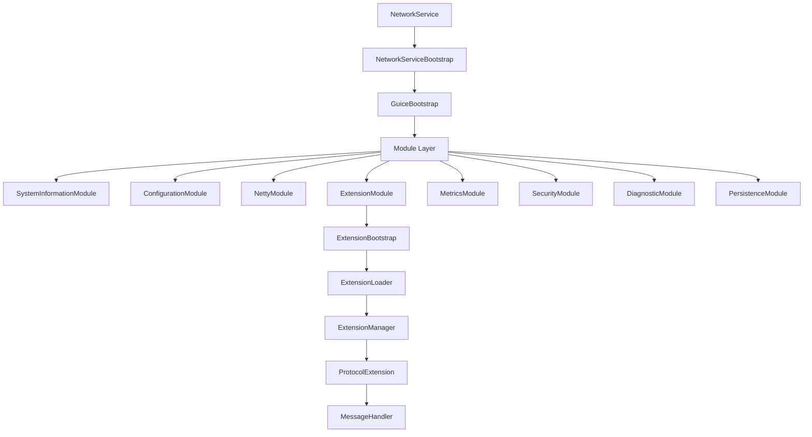
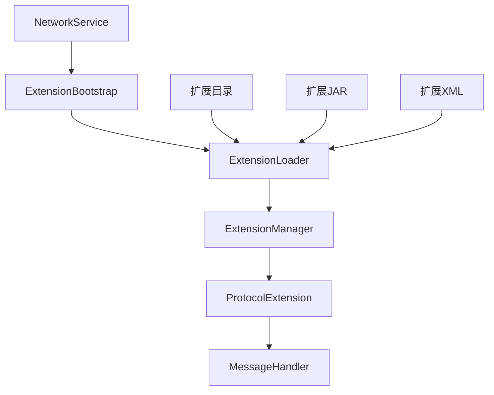

# Network Service Template

基于HiveMQ扩展系统设计的最小化Maven工程模板，支持网络协议的热插拔扩展。

## 🚀 项目特性

- **🔌 热插拔扩展** - 支持运行时动态加载/卸载网络协议扩展
- **🏗️ 模块化架构** - 清晰的模块分离，易于维护和扩展
- **🌐 多协议支持** - 内置MQTT、WebSocket、TCP等协议扩展示例
- **⚡ 高性能** - 基于Netty的高性能网络框架
- **🛠️ 易于开发** - 简单的API接口，快速开发自定义协议扩展

## 📁 项目结构

```
network-service-template/
├── pom.xml                          # 父POM
├── api/                             # 扩展API接口
│   ├── pom.xml
│   └── src/main/java/com/network/api/
├── core/                            # 核心框架
│   ├── pom.xml
│   └── src/main/java/com/network/core/
├── extensions/                      # 协议扩展
│   ├── mqtt-extension/              # MQTT协议扩展
│   ├── websocket-extension/         # WebSocket协议扩展
│   └── tcp-extension/               # TCP协议扩展
└── distribution/                    # 发行包
    ├── pom.xml
    └── src/main/resources/
```

## 🏗️ 核心架构

### 分层设计架构



### 扩展系统设计



### 扩展生命周期

1. **扫描阶段** - 扫描extensions目录，发现扩展
2. **加载阶段** - 创建独立ClassLoader，加载扩展类
3. **启动阶段** - 调用扩展的extensionStart方法
4. **运行阶段** - 处理网络消息和协议逻辑
5. **停止阶段** - 调用扩展的extensionStop方法
6. **清理阶段** - 清理资源，关闭ClassLoader

## 🚀 快速开始

### 1. 构建项目

```bash
# 克隆项目
git clone <repository-url>
cd dtc-service-template

# 构建项目
mvn clean package
```

### 2. 运行服务

```bash
# 进入发行包目录
cd distribution/target/dtc-service-1.0.0

# 启动服务 (Linux/Mac)
./bin/start.sh

# 启动服务 (Windows)
bin\start.bat
```

### 3. 验证服务

```bash
# 检查MQTT服务 (端口1883)
telnet localhost 1883

# 检查WebSocket服务 (端口8080)
curl -i -N -H "Connection: Upgrade" -H "Upgrade: websocket" -H "Sec-WebSocket-Version: 13" -H "Sec-WebSocket-Key: x3JJHMbDL1EzLkh9GBhXDw==" http://localhost:8080/
```

## 🏗️ 分层设计架构

### GuiceBootstrap分层设计

基于HiveMQ的GuiceBootstrap设计，我们的模板采用了分层依赖注入架构：

#### 1. **核心启动器层**
- `NetworkServiceBootstrap` - 网络服务启动器
- `GuiceBootstrap` - Guice依赖注入启动器
- `ExtensionBootstrap` - 扩展系统启动器

#### 2. **模块层**
- `SystemInformationModule` - 系统信息模块
- `ConfigurationModule` - 配置管理模块
- `NettyModule` - 网络通信模块
- `ExtensionModule` - 扩展系统模块
- `MetricsModule` - 指标监控模块
- `SecurityModule` - 安全认证模块
- `DiagnosticModule` - 诊断服务模块
- `PersistenceModule` - 持久化模块

#### 3. **服务层**
- `ConfigurationService` - 配置服务
- `MetricsRegistry` - 指标注册表
- `SecurityManager` - 安全管理器
- `DiagnosticService` - 诊断服务
- `PersistenceManager` - 持久化管理器

#### 4. **扩展层**
- `ExtensionLoader` - 扩展加载器
- `ExtensionManager` - 扩展管理器
- `ExtensionLifecycleHandler` - 扩展生命周期处理器

### 分层优势

1. **🔧 模块化** - 每个模块职责单一，易于维护
2. **🔄 可扩展** - 新功能通过添加新模块实现
3. **🧪 可测试** - 每个模块可以独立测试
4. **📊 可观测** - 完整的监控和诊断体系
5. **🔒 安全性** - 统一的安全管理机制

## 🔧 开发自定义扩展

### 1. 创建扩展项目

```bash
# 创建新的扩展模块
mkdir extensions/my-protocol-extension
cd extensions/my-protocol-extension

# 创建Maven项目结构
mkdir -p src/main/java/com/dtc/myprotocol
```

### 2. 实现扩展接口

```java
// MyProtocolExtension.java
public class MyProtocolExtension implements ExtensionMain, ProtocolExtension {
    
    @Override
    public void extensionStart(ExtensionStartInput input, ExtensionStartOutput output) {
        // 扩展启动逻辑
        System.out.println("My Protocol Extension started!");
    }
    
    @Override
    public void extensionStop(ExtensionStopInput input, ExtensionStopOutput output) {
        // 扩展停止逻辑
        System.out.println("My Protocol Extension stopped!");
    }
    
    @Override
    public String getProtocolName() {
        return "MyProtocol";
    }
    
    @Override
    public String getProtocolVersion() {
        return "1.0.0";
    }
    
    @Override
    public int getDefaultPort() {
        return 9999;
    }
    
    // 实现其他协议方法...
}
```

### 3. 创建扩展配置

```xml
<!-- extension.xml -->
<extension>
    <id>my-protocol-extension</id>
    <name>My Protocol Extension</name>
    <version>1.0.0</version>
    <author>Developer</author>
    <priority>100</priority>
    <start-priority>1000</start-priority>
</extension>
```

### 4. 打包和部署

```bash
# 构建扩展
mvn clean package

# 复制到扩展目录
cp target/my-protocol-extension-1.0.0.jar /path/to/dtc-service/extensions/my-protocol-extension/

# 重启服务或热重载
```

## 📊 扩展API参考

### 核心接口

- **ExtensionMain** - 扩展主接口，定义启动和停止方法
- **ProtocolExtension** - 协议扩展接口，定义协议处理逻辑
- **MessageHandler** - 消息处理器接口，定义消息处理逻辑

### 参数类

- **ExtensionStartInput/Output** - 扩展启动参数
- **ExtensionStopInput/Output** - 扩展停止参数
- **ServerInformation** - 服务器信息

### 注解

- **@NotNull** - 标记非空参数
- **@Nullable** - 标记可空参数

## 🛠️ 配置说明

### 服务器配置 (network-service.xml)

```xml
<network-service>
    <server>
        <name>Network Service</name>
        <version>1.0.0</version>
        <id>network-service-001</id>
    </server>
    
    <listeners>
        <listener>
            <type>mqtt</type>
            <port>1883</port>
            <bind-address>0.0.0.0</bind-address>
            <enabled>true</enabled>
        </listener>
    </listeners>
    
    <extensions>
        <auto-load>true</auto-load>
        <hot-reload>true</hot-reload>
        <scan-interval>5000</scan-interval>
    </extensions>
</network-service>
```

### 扩展配置 (extension.xml)

```xml
<extension>
    <id>extension-id</id>
    <name>Extension Name</name>
    <version>1.0.0</version>
    <author>Developer</author>
    <priority>100</priority>
    <start-priority>1000</start-priority>
</extension>
```

## 🔍 监控和调试

### 日志配置

```xml
<logging>
    <level>INFO</level>
    <pattern>%d{yyyy-MM-dd HH:mm:ss.SSS} [%thread] %-5level %logger{36} - %msg%n</pattern>
    <file>logs/network-service.log</file>
    <max-file-size>10MB</max-file-size>
    <max-history>30</max-history>
</logging>
```

### 性能监控

```xml
<performance>
    <worker-threads>0</worker-threads>
    <boss-threads>1</boss-threads>
    <max-connections>10000</max-connections>
    <connection-timeout>30000</connection-timeout>
</performance>
```

## 🎯 使用场景

- **IoT设备连接** - 支持多种协议的物联网设备接入
- **微服务通信** - 服务间异步消息传递
- **实时数据流** - 传感器数据收集和分发
- **协议网关** - 不同协议之间的转换和路由
- **自定义协议** - 快速实现和部署自定义网络协议

## 🤝 贡献指南

1. Fork 项目
2. 创建特性分支 (`git checkout -b feature/AmazingFeature`)
3. 提交更改 (`git commit -m 'Add some AmazingFeature'`)
4. 推送到分支 (`git push origin feature/AmazingFeature`)
5. 打开 Pull Request

## 📄 许可证

本项目采用 Apache 2.0 许可证 - 查看 [LICENSE](LICENSE) 文件了解详情。

## 🙏 致谢

- 基于 [HiveMQ Community Edition](https://github.com/hivemq/hivemq-community-edition) 的扩展系统设计
- 使用 [Netty](https://netty.io/) 作为网络框架
- 使用 [Google Guice](https://github.com/google/guice) 作为依赖注入容器
